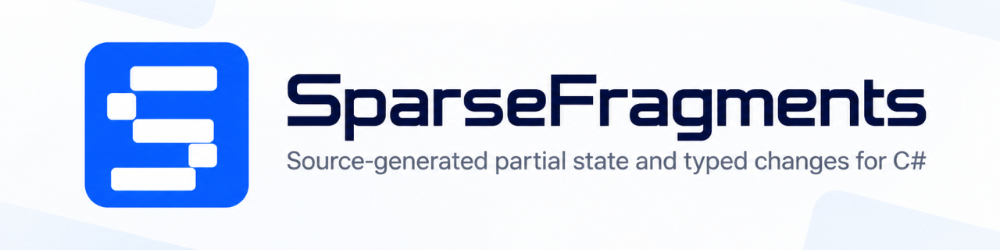

# SparseFragments

[](https://www.nuget.org/packages/SparseFragments/)  [![DeepWiki](https://img.shields.io/badge/DeepWiki-SparseFragments-blue.svg?logo=data:image/png;base64,iVBORw0KGgoAAAANSUhEUgAAACwAAAAyCAYAAAAnWDnqAAAAAXNSR0IArs4c6QAAA05JREFUaEPtmUtyEzEQhtWTQyQLHNak2AB7ZnyXZMEjXMGeK/AIi+QuHrMnbChYY7MIh8g01fJoopFb0uhhEqqcbWTp06/uv1saEDv4O3n3dV60RfP947Mm9/SQc0ICFQgzfc4CYZoTPAswgSJCCUJUnAAoRHOAUOcATwbmVLWdGoH//PB8mnKqScAhsD0kYP3j/Yt5LPQe2KvcXmGvRHcDnpxfL2zOYJ1mFwrryWTz0advv1Ut4CJgf5uhDuDj5eUcAUoahrdY/56ebRWeraTjMt/00Sh3UDtjgHtQNHwcRGOC98BJEAEymycmYcWwOprTgcB6VZ5JK5TAJ+fXGLBm3FDAmn6oPPjR4rKCAoJCal2eAiQp2x0vxTPB3ALO2CRkwmDy5WohzBDwSEFKRwPbknEggCPB/imwrycgxX2NzoMCHhPkDwqYMr9tRcP5qNrMZHkVnOjRMWwLCcr8ohBVb1OMjxLwGCvjTikrsBOiA6fNyCrm8V1rP93iVPpwaE+gO0SsWmPiXB+jikdf6SizrT5qKasx5j8ABbHpFTx+vFXp9EnYQmLx02h1QTTrl6eDqxLnGjporxl3NL3agEvXdT0WmEost648sQOYAeJS9Q7bfUVoMGnjo4AZdUMQku50McDcMWcBPvr0SzbTAFDfvJqwLzgxwATnCgnp4wDl6Aa+Ax283gghmj+vj7feE2KBBRMW3FzOpLOADl0Isb5587h/U4gGvkt5v60Z1VLG8BhYjbzRwyQZemwAd6cCR5/XFWLYZRIMpX39AR0tjaGGiGzLVyhse5C9RKC6ai42ppWPKiBagOvaYk8lO7DajerabOZP46Lby5wKjw1HCRx7p9sVMOWGzb/vA1hwiWc6jm3MvQDTogQkiqIhJV0nBQBTU+3okKCFDy9WwferkHjtxib7t3xIUQtHxnIwtx4mpg26/HfwVNVDb4oI9RHmx5WGelRVlrtiw43zboCLaxv46AZeB3IlTkwouebTr1y2NjSpHz68WNFjHvupy3q8TFn3Hos2IAk4Ju5dCo8B3wP7VPr/FGaKiG+T+v+TQqIrOqMTL1VdWV1DdmcbO8KXBz6esmYWYKPwDL5b5FA1a0hwapHiom0r/cKaoqr+27/XcrS5UwSMbQAAAABJRU5ErkJggg==)](https://deepwiki.com/arika0093/SparseFragments)

*Source-generated partial state and typed changes for C#.*

SparseFragments generates typed APIs around ordinary C# models for partial values, edits, and before to after changes.

Add `[SparseFragmentModel]` to a `partial` model. The application keeps using the same model; the source generator adds the supporting types around it.

It helps when:

* a settings layer must omit a property instead of assigning its default value;
* an editor must preserve which properties the user actually changed;
* a client must send an edit without overwriting unrelated server changes;
* a UI needs notifications and must distinguish a touched field from a value that is still changed;
* a collection needs to track edits by item identity rather than by array position.

Try these cases live in the browser: [*SparseFragments Playground*](https://arika0093.github.io/SparseFragments/).

## Install

```shell
dotnet add package SparseFragments
```

The package contains the source generator, so no additional generation step is required.

## Quick Start

With the .NET 10 SDK or later, the whole example fits in a single file. It layers an environment override over defaults, applies one user edit, and prints the effective values with the typed transition.

<!-- sample: readme-quickstart -->
```csharp
#:package SparseFragments@*

using SparseFragments;

var defaults = Settings.Fragment.From(new Settings
{
    Label = "default",
    Database = new() { Host = "db.local", Port = 5432 },
});

var environment = new Settings.Fragment
{
    Database = new DatabaseSettings.Fragment { Port = 6432 },
};

var effective = defaults.Merge(environment);

var patch = new Settings.Patch { Label = "production" };
patch.Database.Port = 7432;
var updated = effective.Apply(patch);

var changes = Settings.ChangeSet.Between(effective, updated);

Console.WriteLine(updated.ToModel().Label); // production
Console.WriteLine(updated.ToModel().Database!.Host); // db.local, preserved by the patch
Console.WriteLine(changes.Label.IsChanged); // True
Console.WriteLine(changes.Database.Port.Before.Value); // 6432
Console.WriteLine(changes.Database.Port.After.Value); // 7432

[SparseFragmentModel]
public partial class Settings
{
    public string? Label { get; set; }
    public DatabaseSettings? Database { get; set; }
}

public partial class DatabaseSettings
{
    public string Host { get; set; } = "localhost";
    public int Port { get; set; } = 5432;
}
```
<!-- /sample -->

Save it as `quickstart.cs` and run:

```shell
dotnet run --file quickstart.cs
```

A `Fragment` records which values are provided, so the Port-only override leaves Host to fall through from defaults. A `Patch` carries the requested operations, so the edit sets Label and the nested port while Host stays untouched. A `ChangeSet` records the before to after transition, so the output shows Label changed and Port moved from 6432 to 7432. When the same transition must survive concurrent edits, convert it with `ToPayload` and reconcile with `RebaseOnto` (see [ChangeSet rebase](docs/rebase.md)).

## Choose your workflow

The generated types answer different questions:

| Type | Question | Typical use |
| --- | --- | --- |
| `Fragment` | Which values are provided? | Layers, overrides, partially supplied values |
| `Patch` | What should change? | Baseline-free commands and local edits |
| `ChangeSet` | What changed from before to after? | Baseline-aware diff, undo, compose, conflict-aware rebase |
| `ChangePayload` | How does the change travel? | Transport-only typed versioned JSON |
| `EditSession` | What is still unsaved? | Synchronous editing against a retained baseline |

The Quick Start uses the first three rows: `defaults` carries Label `default` with the full database value, `environment` carries only Port 6432, and `effective` merges to Label `default`, Host `db.local`, Port 6432. The patch sets Label to `production` and Port to 7432 while Host stays `db.local`. The change set reports Label `default` to `production` and Port 6432 to 7432, with Host unchanged. The transport row serializes that same change set; see the [ChangePayload wire reference](docs/change-payload.md). The editing row tracks unsaved work in a running UI; see [UI frameworks](docs/ui-frameworks.md).

For task guidance, see [Fragments and patches](docs/fragments-and-patches.md) for construction, diffing, and merge rules, [Merge strategies](docs/merge-strategies.md) for layering, [ChangeSet rebase](docs/rebase.md) for reconciling concurrent edits, [Keyed collections](docs/keyed-collections.md) for identity-based collection edits, and [UI frameworks](docs/ui-frameworks.md) for edit sessions in Blazor, WPF, WinForms, .NET MAUI, WinUI, and Avalonia.

## What each capability covers

The sections below expand the Quick Start proof by scenario. Each one links to the guide that defines the behavior.

### Partial values

A settings layer often needs to distinguish "not specified" from "explicitly set to `null`". A normal nullable property cannot represent both meanings at once.

A generated `Fragment` keeps that distinction:

```csharp
var user = new Settings.Fragment { Label = (string?)null };
var effective = defaults.Merge(user);
```

This is useful for defaults, environment settings, tenant settings, user overrides, and other partially supplied values.

See [Fragments and patches](docs/fragments-and-patches.md) and [Merge strategies](docs/merge-strategies.md) for construction, diffing, and merge rules.

### Partial edits

A full edited object does not say which values the user intended to change. Treating every property as an update can overwrite values the editor never touched.

A generated `Patch` contains only the requested operations:

```csharp
var patch = new Settings.Patch();
patch.Database.Port = 6432;

var updated = current.Apply(patch);
```

This is useful for local commands, partial-update APIs, and edits created in another process. EF Core already tracks edits made directly to tracked entities; SparseFragments is useful when the edit arrives from elsewhere.

See [Fragments and patches](docs/fragments-and-patches.md) for patch operations and application.

### Before to after changes

Undo, audit output, conflict detection, and synchronization need more than the final value. They need to know what changed.

A generated `ChangeSet` records that transition:

```csharp
var changes = Settings.ChangeSet.Between(before, after);

changes.Database.Port.IsChanged;
changes.Database.Port.Before;
changes.Database.Port.After;
```

See [Fragments and patches](docs/fragments-and-patches.md) for typed transitions, inversion, composition, and conversion back to a patch.

### Client and server edits

A `ChangeSet` crosses a process boundary through its generated payload, using the transport the application already owns:

```csharp
var json = JsonSerializer.Serialize(changes.ToPayload());
var incoming = JsonSerializer.Deserialize<Settings.ChangePayload>(json)!.ToChangeSet();

var rebased = incoming.RebaseOnto(current);
```

Rebasing preserves unrelated newer changes instead of replacing current state with a stale object. Conflicting edits are reported separately.

See [ChangeSet rebase](docs/rebase.md) for the client and server flow and conflict handling, and the [ChangePayload wire reference](docs/change-payload.md) for the exact JSON contract.

### UI editing

Change notification and "there is still something to save" are different questions. A field can be touched and then restored to its original value.

An edit session (the per-model `EditSession` in `SparseFragments.Generated`, reached through `CreateEditSession()`) compares a retained baseline with the live model. It is synchronous and provides no transport or conflict framework:

```csharp
var session = order.CreateEditSession();
session.Observable.Name = "Updated";

var submitted = session.CreateChangeSet();
var response = await SendChangesAsync(submitted.ToPayload());
if (response.IsSuccess)
{
    // Advances the baseline only. The live model is untouched,
    // so edits made after CreateChangeSet stay pending.
    session.AcceptChanges(submitted);
}
```

Bind controls to `session.Observable` and read display state from `session.Current`. The proxy edits the live model with notifications; the read-only view exposes the same state without setters. A raw `session.Model` reference edits the same instance without notifications and disables the session's observable-change cache, so prefer the proxy while the session tracks edits. Group one user action with `BatchEdit`, and undo unsaved edits with `RevertChanges()`:

```csharp
session.Observable.Name = "Updated";
string shown = session.Current.Name;

session.BatchEdit(() =>
{
    session.Observable.Name = "Batched";
});

session.RevertChanges();
// session.HasChanges == false
```

The recommended workflow disables editing in the UI while a save is in flight, then starts a fresh session from the returned server state (`persisted.CreateEditSession()`). This naturally picks up server-assigned keys, timestamps, and normalization.

For forms that keep editing enabled during submission, `session.AcceptChanges(submitted)` advances only the baseline so edits made after `CreateChangeSet` stay pending. This approach requires that the server makes no schema changes, key assignments, or normalization. When the destination object is already bound to the UI, prefer the conflict-checked `ChangeSet.TryApplyInPlace`: it rebases onto the bound model's current state, preserves unrelated concurrent edits, and reports conflicting or immutable-member edits as structured conflicts instead of overwriting silently.

```csharp
var pending = baseline.CreateChangeSet(edited);
if (!pending.TryApplyInPlace(boundModel, out var conflicts))
{
    ShowConflicts(conflicts);
    return;
}
// boundModel now carries the change; unrelated concurrent edits are preserved.
```

The explicit blind form `changes.ToPatch().ApplyInPlace(model)` skips the before-state check and can no longer rebase or report conflicts. See [ChangeSet rebase](docs/rebase.md) for the safe and blind in-place options.

`ChangeSet.EnumerateChanges()` (flattened rows for logs and lists) is an advanced seam. Ordinary editing uses `Observable`, `Current`, and the typed transitions. See [UI frameworks](docs/ui-frameworks.md) for sessions, `EditContext` handling, validation, and `Observable` wrappers for Blazor, WPF, WinForms, .NET MAUI, WinUI, and Avalonia integration.

### Keyed collections

Collection edits need stable identity. Array positions are not enough when items can be inserted, removed, or reordered.

With a `[SparseKey]` on the element model, changes are exposed by key:

```csharp
var changes = Roster.ChangeSet.Between(before, after);

changes.Quests.Added;
changes.Quests.Removed;
changes.Quests.Edited;
changes.Quests.OrderChanged;
```

See [Keyed collections](docs/keyed-collections.md) for key rules and per-item transitions. The [Playground](https://arika0093.github.io/SparseFragments/) shows the behavior interactively.

## Generated API

### Presence tracking

`Optional<T>` represents the three states that a normal property cannot distinguish: missing, present `null`, and present value.

<!-- sample: readme-optional-states -->
```csharp
Optional<string?> missing = Optional<string?>.Missing;
Optional<string?> value = "hello";
Optional<string?> explicitNull = Optional<string?>.Present(null);
```
<!-- /sample -->

Generated fragments use this distinction while exposing model-shaped members, so application code normally works through the generated types instead of maintaining presence flags by hand. A Patch `Remove()` drops one member contribution back to missing; on the next merge that member falls through to the lower layer. It never assigns the C# default or runs a constructor. This removal behavior is independent of the Quick Start values above: it describes what happens to any single member contribution when it becomes Missing.

### Source generation

<!-- illustrative: simplified names; does not compile as written -->
`[SparseFragmentModel]` generates code shaped like the following schematic (names simplified; it does not compile as written). The state and
operation families stay nested in the model; per-model UI and editing types
live in a stable `SparseFragments.Generated` container:

```csharp
partial class Settings
{
    public Settings DeepClone();

    public sealed class Fragment;
    public sealed class Patch;
    public sealed class ChangeSet;
    public sealed class ChangePayload;
    public sealed class FragmentBuilder;
}

// In namespace SparseFragments.Generated, one container per model:
// <Container>.Observable, <Container>.ReadOnlyView, <Container>.EditSession.
```

Previously these UI and editing types were nested in the model
(`Settings.EditSession`, `Settings.Observable`, `Settings.ReadOnlyView`).
Update explicit references to the container paths, or use `var` with
`CreateEditSession()` and `ToObservable()` instead of naming the types.
There are no backwards-compatibility aliases. See
[Relocated generated types](docs/ui-frameworks.md#relocated-generated-types)
for the full old-to-new mapping.

Reachable eligible `partial` nested types receive the corresponding generated APIs as well. See [Model shapes](docs/model-shapes.md) for the supported shapes and constructor rules.

The code is generated at compile time, uses no reflection for these generated operations, and works with NativeAOT.

## Documentation

| Task | Guide |
| --- | --- |
| Construct fragments, patches, and transitions | [Fragments and patches](docs/fragments-and-patches.md) |
| Layer defaults and overrides | [Merge strategies](docs/merge-strategies.md) |
| Observe and rebase before to after changes | [ChangeSet rebase](docs/rebase.md) |
| Send a change across a process boundary | [ChangePayload wire reference](docs/change-payload.md) |
| Add, remove, edit, and reorder collection items | [Keyed collections](docs/keyed-collections.md) |
| Track edits in Blazor, WPF, MAUI, WinUI, or Avalonia | [UI frameworks](docs/ui-frameworks.md) |
| Control copying and reference sharing | [Clone & ownership](docs/cloning-and-ownership.md) |
| Check supported model shapes and constructors | [Model shapes](docs/model-shapes.md) |
| Resolve generator errors | [Diagnostics](docs/analyzer.md) |

## Packages and Compatibility

### SparseFragments

* Released as `netstandard2.0`.
  * .NET Framework 4.6.1 or later
  * .NET Core 2.0 or later, .NET 5 or later
  * .NET MAUI and other platforms that support `netstandard2.0` (see [Select .NET Standard version](https://learn.microsoft.com/en-us/dotnet/standard/net-standard?tabs=net-standard-2.0#select-net-standard-version)).
* Generated code requires C# 9.0 or later.
  * Set `<LangVersion>9.0</LangVersion>` (or later) in the consuming project.
  * The `netstandard2.0` and .NET Framework targets default to C# 7.3, so those consumers must opt in explicitly.
* Source generation runs in any build that uses Roslyn 4.3.1 or later (SDK and compiler requirement). The versions below add design-time IDE support:
  * VisualStudio 2022: 17.3 or later
  * JetBrains Rider: 2023.1 or later
  * Unity: 6 or later

### SparseFragments.Blazor

Requires `net8.0` or later.

## License

Licensed under the Apache-2.0 License.
